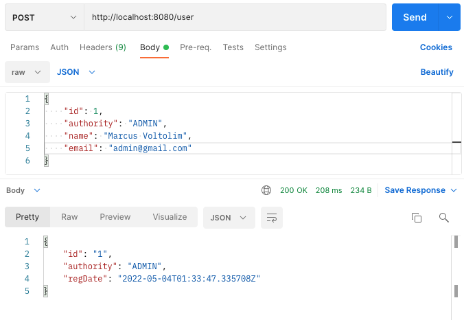

## [DynamoDB Enhanced Client](https://docs.aws.amazon.com/sdk-for-java/latest/developer-guide/dynamodb-enhanced-client.html)

O cliente avançado do Amazon DynamoDB é uma biblioteca de alto nível que faz parte do AWS SDK for Java versão 2 (v2). Ele oferece uma maneira simples de mapear classes do lado do
cliente para tabelas do DynamoDB. Defina as relações entre as tabelas e suas classes de modelo correspondentes no seu código. Depois, você poderá executar intuitivamente várias
operações de criação, leitura, atualização ou exclusão (CRUD) em tabelas ou itens do DynamoDB.
O AWS SDK for Java v2 inclui um conjunto de anotações que você pode usar com um bean Java para gerar rapidamente um TableSchema para mapear suas classes para tabelas. Como opção,
se você declarar cada TableSchema explicitamente, não será necessário incluir anotações em suas classes.

## Introdução

Projeto SpringBoot Web com Groovy/Java exemplificando como mapear tabelas do DynamoDb em entidades usando anotações similar ao SpringJPA.
Com endpoints para fazer operações de CRUD e testar o funcionamento na prática.

## Tecnologias

* SpringBoot 2.6.7
* AWS 2.17.182 → `implementation 'software.amazon.awssdk:dynamodb-enhanced:2.17.182'`
* Java 11
* Groovy 3.0.10
* Gradle 7.4.1

## Explicação

Necessário conhecimento prévio de Spring, injeção de dependência, aws-sdk-java-v2, NoSQL...
*Vamos usar LocalStack para emular os serviços da AWS localmente!
Nesse [repositório](https://github.com/marcusvoltolim/localstack-aws) está explicado como funciona o LocalStack e dynamodb-admin.*

Para quem conhece o *SpringJPA* já está familiarizado com o uso de anotações para mapear tabela(s) e coluna(s) em objeto/entidade e campos/atributos.
A implementção está seguindo o padrão MVC, estão temos Controller, Service, Repository, Model.

**As classes mapeadas precisam ser Java (.java), pois devido às particularidades do Groovy (leia-se MetaClass) não funciona.**

Iremos usar o cliente **DynamoDbEnhancedClient** e as seguintes anotações:

* `@DynamoDbBean` *[obrigatória] [classe]*: Identifica a classe anotada como sendo uma entidade mapeável do DynamoDb;
* `@DynamoDbPartitionKey` *[obrigatória] [método]*: Indica que o atributo anotado é a chave de partição primária (hashKey) da tabela DynamoDb.
* `@DynamoDbSortKey` *[opcional] [método]*: Indica que o atributo anotado é a chave de classificação primária (sortKey) opcional da tabela DynamoDb;
* `@DynamoDbAttribute(String value)` *[opcional] [método]*: Especifica um nome diferente para o atributo do que o mapeador inferiria automaticamente usando uma estratégia de
  nomenclatura;
  * Por exemplo: se temos na tabela a coluna `dtNasc` e queremos mapear na entidade para `dataNascimento` anotamos com `@DynamoDbAttribute('dtNasc')`;
* `@DynamoDbConvertedBy` *[opcional] [método]*: Usada para associar um *AttributeConverter* personalizado ao atributo;
* `@DynamoDbIgnore` *[opcional] [método]*: Indica que o atributo será ignorado pelo mapeador, ou seja, não participa do schema da tabela;
* As anotações de nível de método não podem ser usadas no atributo/campo diretamente, sendo assim,
  mesmo que você esteja usando Groovy ou Java com Lombok precisará ter um getter ou setter do campo para ser anotado;
* O mapeamento não funciona com tipos primitivos: `int, long, boolean...`, então use o tipo equivalente: `Integer, Long, Boolean...`;
* As anotações: `@DynamoDbPartitionKey, @DynamoDbSortKey`  só podem ser usadas em atributos com um tipo escalar do DynamoDb (string, número ou binário);
* Existem outras anotações que podem ser vistas no pacote `software.amazon.awssdk.enhanced.dynamodb.mapper.annotations`;
* Para instanciar o *DynamoDbEnhancedClient* temos que passar o *DynamoDbClient* como parâmetro, ou seja, debaixo dos panos ele usa o cliente "tradicional".

Podemos ter classes mapeadas que contém campos que referenciam outra classe mapeada, no exemplo do projeto temos [`User`](src/main/groovy/io/marcusvoltolim/dynamodbenhanced/models/User.java) que contém uma lista  de [`Address`](src/main/groovy/io/marcusvoltolim/dynamodbenhanced/models/Address.java), como podemos ver no trecho de código abaixo:

```java
@Getter
@Setter
@DynamoDbBean
public class User {

  private String id;
  private AuthorityType authority;
  private String name;
  private String email;
  private List<Address> addresses;

  @JsonProperty(access = JsonProperty.Access.READ_ONLY)
  private Instant regDate;

  @JsonProperty(access = JsonProperty.Access.READ_ONLY)
  private Instant updatedDate;

  @DynamoDbPartitionKey
  public String getId() {
    return id;
  }

  @DynamoDbSortKey
  @DynamoDbAttribute("authorityLevel")
  public AuthorityType getAuthority() {
    return authority;
  }

}
```
```java
@Getter
@Setter
@DynamoDbBean
public class Address {

  private AddressType type;
  private String street;
  private String number;
  private String zipCode;
  private String state;
  private String city;
  private String country;

}
```
Esse mapeamento resulta no JSON abaixo:
```json
{
  "name": "Marcus Voltolim",
  "regDate": "2022-05-04T15:53:54.362646Z",
  "addresses": [
    {
      "country": "Brasil",
      "number": "123",
      "zipCode": "10000-000",
      "city": "São Paulo",
      "street": "Rua 1",
      "state": "SP",
      "type": "PERSONAL"
    },
    {
      "country": "Brasil",
      "number": "1050",
      "zipCode": "99999-999",
      "city": "Rio Branco",
      "street": "Rua 2",
      "state": "AC",
      "type": "BUSINESS"
    }
  ],
  "authorityLevel": "USER",
  "id": "1",
  "email": "email@gmail.com"
}
```

## Executando

### LocalStack - docker-compose

* Necessário ter docker e docker-compose instalados;
* Execute o seguinte comando na raiz do projeto: `docker-compose -up`;
* Após iniciar, os recursos do LocalStack estarão disponíveis na porta: `4566` e região: `sa-east-1`
* As configurações podem ser alteradas no arquivo [docker-compose.yaml](docker-compose.yaml), além de (des)ativar os serviços desejados.

### Aplicação

* Existem diversas maneiras de iniciar uma aplicação SpringBoot;
* Pode usar sua IDE de preferência (eu uso IntelliJ);
* Ou executar o seguinte comando na raiz do projeto: `./gradlew bootRun`
* Independente de como executar, em caso de sucesso terá o log: *Tomcat started on port(s): 8080 (http) with context path ''*,
  informando que a aplicação (endpoints) está sendo exposta na porta: *8080*.

### Endpoints

#### UserController

No [UserController](src/main/groovy/io/marcusvoltolim/dynamodbenhanced/controllers/UserController.groovy) temos os seguintes endpoints:

* Criar novo usuário:
  ```curl
  curl --location --request POST 'http://localhost:8080/user' \
  --header 'Content-Type: application/json' \
  --data-raw '{
      "id": 1,
      "authority": "USER",
      "name": "Marcus Voltolim",
      "email": "email@gmail.com",
      "addresses": [
          {
              "type": "PERSONAL",
              "street": "Rua 1",
              "number": "123",
              "zipCode": "10000-000",
              "state": "SP",
              "city": "São Paulo",
              "country": "Brasil"
          },
          {
              "type": "BUSINESS",
              "street": "Rua 2",
              "number": "1050",
              "zipCode": "99999-999",
              "state": "AC",
              "city": "Rio Branco",
              "country": "Brasil"
          }
      ]
  }'
  ```
  

* Criar usuário com id e authority já existentes retorna erro (pode repetir a mesma chamada anterior):
  

* Criar usuário com id existente porém outra authority:
  ```
  curl --location --request POST 'http://localhost:8080/user' \
  --header 'Content-Type: application/json' \
  --data-raw '{
      "id": 1,
      "authority": "ADMIN",
      "name": "Marcus Voltolim",
      "email": "admin@gmail.com"
  }'
  ```
  

* Listar todos usuários:
  ```
  curl --location --request GET 'http://localhost:8080/user'
  ```
  

* Buscando usuário por id e authority [retorna NotFound (404) se usuário não existir]:
  ```
  curl --location --request GET 'http://localhost:8080/user/1?authority=ADMIN'
  ```
  

  ```
  curl --location --request GET 'http://localhost:8080/user/1?authority=USER'
  ```
  
  

* Atualizar usuário inexistente
  ```
  curl --location --request PUT 'http://localhost:8080/user' \
  --header 'Content-Type: application/json' \
  --data-raw '{
      "id": 11,
      "authority": "ADMIN",
      "name": "Marcus Voltolim",
      "email": "teste-admin@gmail.com"
  }'
  ```
  

* Atualizar usuário (atualiza apenas os campos informados, ignorando os demais)
  ```
  curl --location --request PATCH 'http://localhost:8080/user' \
  --header 'Content-Type: application/json' \
  --data-raw '{
      "id": 1,
      "authority": "USER",
      "name": "Marcus Vinícius",
      "email": "teste-user@gmail.com"
  }'
  ```
  
  

* Deletar usuário [retorna NotFound (404) se usuário não existir]:
  ```
  curl --location --request DELETE 'http://localhost:8080/user/1?authority=ADMIN'
  ```
  
  
*

### Validando - [dynamodb-admin](https://github.com/aaronshaf/dynamodb-admin)

* Listagem:

  

* Detalhes do usuário:

  

